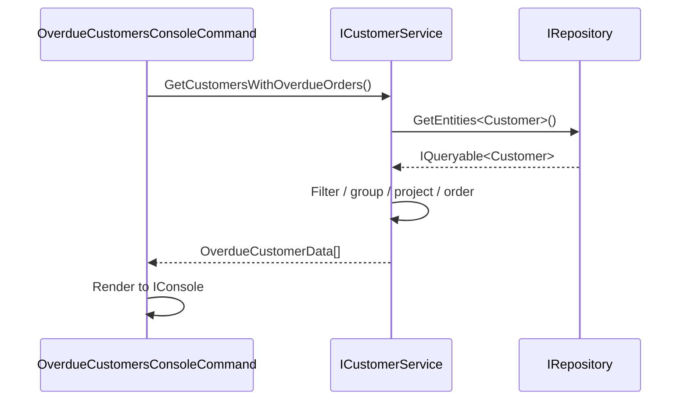

# Design: Customers with Overdue Orders

**Issue**: #1  
**Date**: 2026-05-22  
**Status**: Reviewed

---

## Requirements Summary

Display all customers who have at least one overdue order. An order is overdue when its `DueDate` is earlier than today **and** its `Status` is not closed (i.e., not `Shipped` or `Cancelled`). Results are ordered by the date of each customer's oldest overdue order ascending. Per customer: name, overdue order count, oldest overdue order date.

---

## Module Impact

- [x] Sales
- [ ] ProductsManagement
- [ ] PersonsManagement
- [ ] Notifications
- [ ] Export
- [ ] New Module

---

## High-Level Design

### Services

| Service | Module | Responsibility |
|---|---|---|
| `CustomerService` (extend) | `Sales.Services` | Add `GetCustomersWithOverdueOrders()` — queries customers + order aggregation, filters on `DueDate < today` and open status, maps to `OverdueCustomerData` |

The existing `CustomerService` is extended with one new method to preserve cohesion; no new service is warranted since this remains a customer-centric read query.

### Entities

No entity changes. Existing entities are sufficient:
- `SalesOrderHeader`: `DueDate`, `Status`, `CustomerID`
- `Customer`: `FirstName`, `LastName`, `CompanyName`, navigation `SalesOrderHeaders`

"Closed" is defined by existing `SalesOrderHeaderStatusValues`: `Shipped (5)` and `Cancelled (6)`.

### Console Command

`OverdueCustomersConsoleCommand` in `Sales.ConsoleCommands` — displays the results using the existing `IConsole` abstraction.

---

## Integration Flow

```
1. User selects "Show customers with overdue orders" in the console menu
2. OverdueCustomersConsoleCommand calls ICustomerService.GetCustomersWithOverdueOrders()
3. CustomerService queries IRepository:
   - Filter: SalesOrderHeaders where DueDate < today AND Status is open (not closed)
   - Group by Customer
   - Keep customers with at least one such order
   - Project to OverdueCustomerData (name, count, oldest due date)
   - Order by oldest overdue date ascending
4. Command renders each OverdueCustomerData record to console
```



---

## Boundary Verification

- [x] No cross-module Service references
- [x] All cross-module communication via `Contracts` interfaces
- [x] No direct DbContext usage — only `IRepository.GetEntities<T>()`
- [x] New DTO and interface extension in `Contracts/Sales/`
- [x] Console command registered via `[Service(typeof(IConsoleCommand))]`
- [x] Services use primary constructors for DI
- [x] No write path — read-only query, no `IUnitOfWork` needed

---

## Next Steps

- Detailed design: contract signatures, exception handling, null-safety rules
- Work plan: contract → service → console command → unit tests
