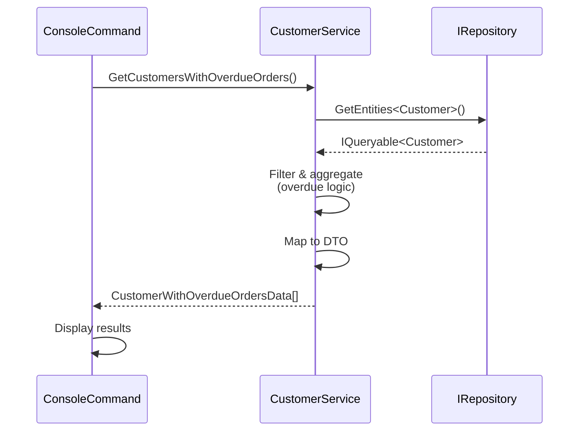

# Design: Show customers with overdue orders

**Issue**: #1  
**Date**: 2025-12-23  
**Status**: Awaiting Review

## Requirements Summary

As a business user, I want to see all customers that have at least one overdue order, so that I can identify accounts that require follow up.

**Overdue Order Definition**: An order where `DueDate < Today` AND `Status != Closed`

**Key Requirements**:
- List only customers with at least one overdue order
- Group orders by customer
- Sort customers by oldest overdue order date (ascending)
- Display: Customer name, number of overdue orders, date of oldest overdue order
- Accessible through console command

## Module Impact

- [x] Sales
- [ ] ProductsManagement
- [ ] PersonsManagement
- [ ] Notifications
- [ ] Export
- [ ] New Module

**Justification**: This feature is entirely within the Sales domain, involving customers and their order information. All necessary entities already exist in `Sales.DataModel`.

## High-Level Design

### Services

**CustomerService** (`Sales.Services/CustomerService.cs`)
- **Extension**: Add method to query customers with overdue orders
- **Responsibility**: Execute repository query to filter customers based on overdue order criteria, aggregate order statistics per customer, and map to DTO

**Key Logic**:
- Filter orders where `DueDate < DateTime.Today` and `Status != ClosedStatusValue`
- Group by customer
- Calculate count of overdue orders per customer
- Find oldest overdue order date per customer
- Sort customers by oldest overdue order date (ascending)

### Data Transfer Objects

**New DTO**: `CustomerWithOverdueOrdersData` (`Modules/Contracts/Sales/`)
- Properties:
  - `CustomerName` (string): Display name of the customer
  - `OverdueOrdersCount` (int): Number of overdue orders
  - `OldestOverdueDueDate` (DateTime): Date of the oldest overdue order

### Console Commands

**New Command**: `CustomersWithOverdueOrdersConsoleCommand` (`Sales.ConsoleCommands/`)
- Menu label: "Show customers with overdue orders"
- Calls `ICustomerService.GetCustomersWithOverdueOrders()`
- Displays results using console helper methods

### Contracts

**ICustomerService** (`Modules/Contracts/Sales/ICustomerService.cs`)
- **Extension**: Add new method signature for retrieving customers with overdue orders

### Entities

**No Changes Required**
- `Customer` entity (Sales.DataModel.SalesLT) - already exists
- `SalesOrderHeader` entity (Sales.DataModel.SalesLT) - already exists
- Relationship: `Customer.SalesOrderHeaders` navigation property - already exists

**Status Field**: The `SalesOrderHeader.Status` field is of type `byte`. The specific value(s) representing "closed" status need to be determined from business logic or constants.

## Integration Flow

```
1. User selects console command
2. CustomersWithOverdueOrdersConsoleCommand.Execute() called
3. Command invokes ICustomerService.GetCustomersWithOverdueOrders()
4. CustomerService queries via IRepository:
   - GetEntities<Customer>() with navigation to SalesOrderHeaders
   - Filter orders: DueDate < Today AND Status != Closed
   - Group by customer
   - Aggregate: count overdue orders, find min(DueDate)
   - Order by min(DueDate) ascending
   - Project to CustomerWithOverdueOrdersData
5. Service returns array of CustomerWithOverdueOrdersData
6. Console command displays results to user
```

### Sequence Diagram



## Boundary Verification

- [x] No `*.Services` → `*.Services` cross-module references
- [x] All cross-module communication via `Contracts` interfaces (N/A - single module)
- [x] No direct DbContext usage in Services (only `IRepository`)
- [x] New interface extension added to `Contracts` (ICustomerService)
- [x] Entity interceptors not needed for read-only operation
- [x] Services use primary constructors for DI (existing pattern)
- [x] All public APIs are async (Note: Current codebase uses synchronous patterns for customer queries - maintaining consistency)

## Design Decisions

### Status Value for "Closed"
The design assumes a constant or configuration will define which `Status` value(s) represent "closed" orders. Implementation will need to determine this from existing codebase patterns or business requirements.

### Customer Name Display
The `Customer` entity has `FirstName`, `LastName`, and `CompanyName` fields. The display name logic will:
- Use `CompanyName` if available
- Otherwise combine `FirstName` and `LastName`

### Query Efficiency
The query uses a single database call with:
- Navigation property to load related orders
- Filter applied at database level
- Aggregations performed in database (via LINQ to Entities)
- Projection to DTO to minimize data transfer

## Next Steps

1. Implement contract: Add method to `ICustomerService`
2. Create DTO: Define `CustomerWithOverdueOrdersData` class
3. Implement service: Add method to `CustomerService`
4. Create console command: Implement `CustomersWithOverdueOrdersConsoleCommand`
5. Manual testing via console UI
6. Ready for code review
