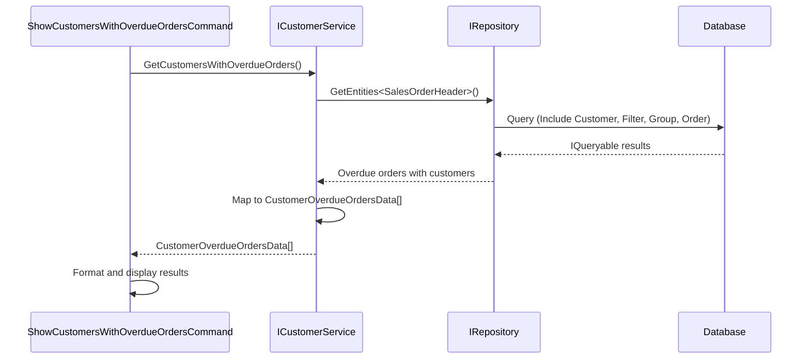

# Design: Show customers with overdue orders

**Issue**: #1  
**Date**: December 22, 2025  
**Status**: Awaiting Review

## Requirements Summary

Display customers with at least one overdue order via a console command. An order is overdue when its `DueDate` is earlier than today and its `Status` is not closed. Results should show customer name, count of overdue orders, and oldest overdue order date, sorted by oldest overdue date ascending.

## Module Impact

- [x] Sales
- [ ] ProductsManagement
- [ ] PersonsManagement
- [ ] Notifications
- [ ] Export
- [ ] New Module

## High-Level Design

### Services

**ICustomerService** (extend existing in `Sales.Services/CustomerService.cs`)
- Add method to query customers with overdue orders
- Returns customer details including aggregated overdue order information
- Responsibilities: Execute query logic against `IRepository`, aggregate data, map to DTO

### DTOs

**CustomerOverdueOrdersData** (new in `Modules/Contracts/Sales/`)
- Properties: CustomerName, OverdueOrderCount, OldestOverdueOrderDate
- Purpose: Transport query results to console command

### Console Command

**ShowCustomersWithOverdueOrdersCommand** (new in `Sales.ConsoleCommands/`)
- Command name: "show-overdue-customers" or similar
- Responsibilities: Invoke `ICustomerService`, format output for console display
- Implements `IConsoleCommand` with `[Service]` attribute

### Data Access Pattern

Read-only query via `IRepository`:
- Query `SalesOrderHeader` entities with includes for `Customer` navigation property
- Filter: `DueDate < DateTime.UtcNow` AND `Status != closedStatusValue`
- Group by `Customer`
- Calculate: count of orders per customer, minimum (oldest) `DueDate`
- Order by: oldest `DueDate` ascending

### Integration Flow

**Sequence Description:**
1. Console command invokes `ICustomerService.GetCustomersWithOverdueOrders()`
2. Service queries `SalesOrderHeader` via `IRepository.GetEntities<T>()`
3. Query includes Customer navigation, filters by due date and status, groups by customer
4. Service aggregates data (count, oldest date) and maps to `CustomerOverdueOrdersData` DTO
5. Command receives results and formats output to console

## Boundary Verification

- [x] No cross-module Service references
- [x] Uses `IRepository` for read-only queries (no `IUnitOfWork` needed)
- [x] New DTO added to `Contracts/Sales` (shared interface layer)
- [x] Console command implements `IConsoleCommand` pattern
- [x] Service method registered via existing `ICustomerService` interface (extend interface)
- [x] All code in Sales module boundaries
- [x] Async pattern maintained end-to-end

## Design Decisions

**Extend ICustomerService vs Create New Service:**  
Chose to extend existing `ICustomerService` because querying customer data with order-related filters maintains high cohesion. This is a customer-centric query, not an order-centric one.

**Status Field Interpretation:**  
Assumption: `Status` field in `SalesOrderHeader` uses numeric values where specific values represent "closed" orders. Implementation will need clarification on which status value(s) indicate closed orders (e.g., `Status == 5` or similar).

**Query Performance:**  
For large datasets, the query might benefit from database-side aggregation. The design uses LINQ which will translate to efficient SQL via EF Core's query provider.

## Next Steps

- Detailed design phase (method signatures, exception handling)
- Determine closed order status value(s) from domain knowledge or database
- Create work plan for implementation
- Review by @architect-reviewer
