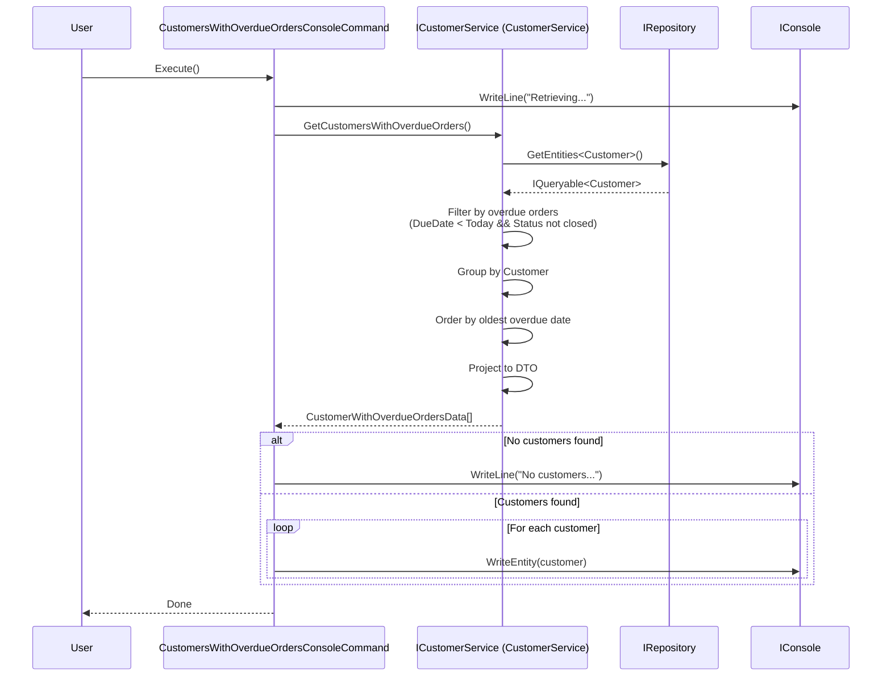

# Design: Show customers with overdue orders

**Issue**: Show customers with overdue orders
**Date**: 2025-12-22
**Status**: Awaiting Review

## Requirements Summary

As a business user, I want to see all customers that have at least one overdue order, so that I can identify accounts that require follow up.

**Overdue Order Definition**: An order is considered overdue when its due date is earlier than today and its status is not closed (Shipped=5 or Cancelled=6).

**Acceptance Criteria**:
- Lists only customers with at least one overdue order
- Orders are grouped by customer
- Customers ordered by date of their oldest overdue order (ascending)
- For each customer, display:
  - Customer name
  - Number of overdue orders
  - Date of the oldest overdue order
- Accessible through console command

## Module Impact
- [x] Sales
- [ ] ProductsManagement
- [ ] PersonsManagement
- [ ] Notifications
- [ ] Export
- [ ] New Module: [none]

## High-Level Design

This feature extends the existing Sales module capabilities. It follows the established pattern used by `CustomersWithOrdersConsoleCommand` and similar commands.

### Services

**ICustomerService** (existing service to be extended)
- **Module**: `Sales.Services`
- **Responsibilities**: Query and filter customers based on order criteria
- **New Method**: Add method to retrieve customers with overdue orders
- **Lifetime**: Transient (existing)

### Entities

**No entity changes required**. The feature uses existing entities:
- `Customer` (Sales.DataModel.SalesLT.Customer)
  - Properties used: CustomerID, FirstName, LastName, CompanyName, SalesOrderHeaders
- `SalesOrderHeader` (Sales.DataModel.SalesLT.SalesOrderHeader)
  - Properties used: DueDate, Status

### Contracts

**New DTO**: `CustomerWithOverdueOrdersData`
- **Location**: `Modules/Contracts/Sales/`
- **Properties**:
  - `int CustomerId` - Customer identifier
  - `string CustomerName` - Formatted customer name (FirstName + LastName or CompanyName)
  - `int OverdueOrdersCount` - Number of overdue orders for this customer
  - `DateTime OldestOverdueDateDate` - Date of the oldest overdue order

**Extend Interface**: `ICustomerService`
- **Location**: `Modules/Contracts/Sales/ICustomerService.cs`
- **New Method**: `CustomerWithOverdueOrdersData[] GetCustomersWithOverdueOrders()`

### Console Commands

**New Command**: `CustomersWithOverdueOrdersConsoleCommand`
- **Location**: `Modules/Sales/Sales.ConsoleCommands/`
- **Menu Label**: "Show customers with overdue orders"
- **Responsibilities**:
  - Call `ICustomerService.GetCustomersWithOverdueOrders()`
  - Display results in console using `IConsole.WriteEntity()`
  - Handle empty result set with appropriate message

### Integration Flow

```
1. User selects console command from menu
2. CustomersWithOverdueOrdersConsoleCommand.Execute() called
3. Command calls ICustomerService.GetCustomersWithOverdueOrders()
4. CustomerService queries IRepository.GetEntities<Customer>()
   - Filters customers with SalesOrderHeaders.Any(o => o.DueDate < DateTime.Today && o.Status != Shipped && o.Status != Cancelled)
   - Projects to CustomerWithOverdueOrdersData
   - Orders by minimum DueDate (oldest overdue order first)
5. Results returned as CustomerWithOverdueOrdersData[]
6. Command displays each customer using console.WriteEntity()
```

#### Sequence Diagram



## Work Plan

### 1. Define Contracts (FIRST PRIORITY)
- Create `CustomerWithOverdueOrdersData` DTO in `Modules/Contracts/Sales/`
  - Properties: CustomerId, CustomerName, OverdueOrdersCount, OldestOverdueDateDate
- Extend `ICustomerService` interface in `Modules/Contracts/Sales/ICustomerService.cs`
  - Add method: `CustomerWithOverdueOrdersData[] GetCustomersWithOverdueOrders()`

### 2. Implement Service Method
- Extend `CustomerService` in `Modules/Sales/Sales.Services/CustomerService.cs`
- Implement `GetCustomersWithOverdueOrders()`:
  - Query customers with overdue orders using LINQ
  - Filter: `DueDate < DateTime.Today && Status != 5 && Status != 6`
  - Use `SalesOrderHeaderStatusValues.Shipped` and `SalesOrderHeaderStatusValues.Cancelled`
  - Group by customer
  - Calculate count and oldest date per customer
  - Order by oldest overdue date ascending
  - Project to `CustomerWithOverdueOrdersData`

### 3. Create Console Command
- Create `CustomersWithOverdueOrdersConsoleCommand` in `Modules/Sales/Sales.ConsoleCommands/`
- Register with `[Service(typeof(IConsoleCommand))]` attribute
- Inject `IConsole` and `ICustomerService` via primary constructor
- Implement `Execute()` method to call service and display results
- Set `MenuLabel` to "Show customers with overdue orders"

### 4. Testing
- Unit tests in `Sales.Services.UnitTests/` (if tests exist)
- Manual testing via console application

## Boundary Verification

- [x] No `*.Services` → `*.Services` cross-module references (only Sales module affected)
- [x] All cross-module communication via `Contracts` interfaces (not applicable - single module)
- [x] No direct DbContext usage in Services (uses `IRepository`)
- [x] New DTO and interface extension added to `Contracts` assembly
- [x] No entity interceptors needed (read-only query)
- [x] Service uses primary constructor for DI
- [x] No async needed (existing pattern in CustomerService is synchronous)

## Technical Considerations

### Overdue Order Logic
An order is overdue if:
- `DueDate < DateTime.Today` (due date has passed)
- AND `Status != SalesOrderHeaderStatusValues.Shipped` (5)
- AND `Status != SalesOrderHeaderStatusValues.Cancelled` (6)

Statuses considered "not closed" (potentially overdue):
- InProcess (1)
- Approved (2)
- Backordered (3)
- Rejected (4)

### Customer Name Display
Follow existing pattern from `CustomerData`:
- Use `CompanyName` if available
- Otherwise format as `FirstName + " " + LastName`

### Query Optimization
Use LINQ to Entities for efficient SQL generation:
- Single query with joins and grouping
- Avoid N+1 queries by using `.Include()` or projection
- Filter at database level, not in-memory

## Next Steps
1. Detailed design phase (finalize DTO properties, method signatures)
2. Implementation following work plan order
3. Manual testing through console UI
4. Review by architect-reviewer agent
