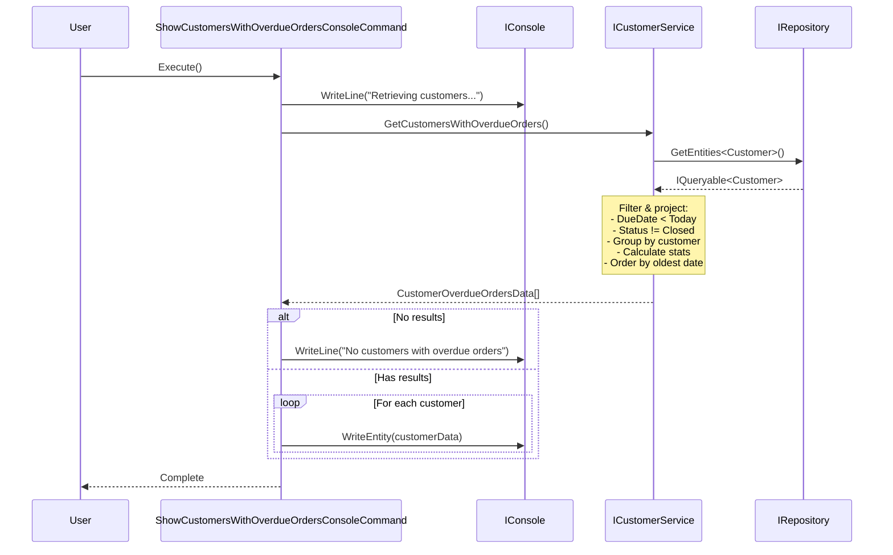

# Design: Show customers with overdue orders

**Issue**: Show customers with overdue orders
**Date**: 2025-12-22
**Status**: Awaiting Review

## Requirements Summary

As a business user, I need to identify customers that have at least one overdue order to determine which accounts require follow-up.

**Business Rules:**
- An order is overdue when: `DueDate < Today AND Status != Closed`
- Orders are grouped by customer
- Results are sorted by the oldest overdue order date (ascending)

**Output Requirements:**
- Customer name
- Number of overdue orders for that customer
- Date of the oldest overdue order for that customer

**Access:** Console command

## Module Impact

- [x] Sales (primary module affected)
- [ ] ProductsManagement
- [ ] PersonsManagement
- [ ] Notifications
- [ ] Export
- [ ] New Module: N/A

## High-Level Design

### Services

#### ICustomerService (Extended)
**Module:** `Modules/Contracts/Sales/ICustomerService.cs`
**Changes:** Add new method to the existing interface

**Responsibilities:**
- Expose a new method to retrieve customers with overdue orders
- Method returns a DTO containing customer information and overdue order statistics

**Rationale for extending existing service:**
- The feature is closely related to customer queries already present in `ICustomerService`
- Maintains high cohesion - all customer-related queries are in one service
- Avoids proliferation of single-method services
- Follows the Single Responsibility Principle: customer data retrieval

#### CustomerService (Extended)
**Module:** `Modules/Sales/Sales.Services/CustomerService.cs`
**Changes:** Implement the new method

**Implementation approach:**
- Use `IRepository.GetEntities<Customer>()` for read-only access
- Join with `SalesOrderHeader` navigation property
- Filter orders by: `DueDate < DateTime.Today` AND `Status != SalesOrderHeaderStatusValues.Shipped` (assuming Shipped is the closed status)
- Group by customer
- Calculate: count of overdue orders, minimum (oldest) due date
- Order results by oldest due date ascending
- Project to new DTO

### Data Transfer Objects

#### CustomerOverdueOrdersData (New)
**Module:** `Modules/Contracts/Sales/CustomerOverdueOrdersData.cs`

**Properties:**
```csharp
public class CustomerOverdueOrdersData
{
    public int CustomerId { get; set; }
    public string CustomerName { get; set; }  // Company name or FirstName + LastName
    public int OverdueOrdersCount { get; set; }
    public DateTime OldestOverdueOrderDate { get; set; }
}
```

### Console Commands

#### ShowCustomersWithOverdueOrdersConsoleCommand (New)
**Module:** `Modules/Sales/Sales.ConsoleCommands/ShowCustomersWithOverdueOrdersConsoleCommand.cs`

**Responsibilities:**
- Registered via `[Service(typeof(IConsoleCommand))]` attribute
- Display menu label: "Show customers with overdue orders"
- Call `ICustomerService.GetCustomersWithOverdueOrders()`
- Display results using `IConsole.WriteEntity()` for each customer
- Handle empty results case

### Entities

**No entity changes required** - all necessary data exists in:
- `Customer` entity (for customer information)
- `SalesOrderHeader` entity (for order DueDate and Status)

### Status Value Clarification

**Note:** Need to clarify which status value(s) represent "closed" orders:
- Current values: InProcess(1), Approved(2), Backordered(3), Rejected(4), Shipped(5), Cancelled(6)
- Assumption for design: Orders with Status = Shipped(5) are considered closed/completed
- Alternative: Multiple statuses could represent "closed" (Shipped, Cancelled, Rejected)
- **Decision needed:** Confirm business definition of "closed" status

## Integration Flow

```
1. User selects console command "Show customers with overdue orders"
2. ShowCustomersWithOverdueOrdersConsoleCommand.Execute() is called
3. Command calls ICustomerService.GetCustomersWithOverdueOrders()
4. CustomerService queries via IRepository:
   - Gets Customer entities with SalesOrderHeaders navigation
   - Filters orders: DueDate < Today AND Status != Closed
   - Groups by customer
   - Calculates: overdue count, oldest due date
   - Orders by oldest due date ascending
   - Projects to CustomerOverdueOrdersData[]
5. Command displays results using IConsole.WriteEntity()
6. User sees formatted output in console
```

### Sequence Diagram



## Data Access Pattern

**Read-Only Query** - Uses `IRepository` pattern:
```csharp
var customers = repository.GetEntities<Customer>()
    .Where(c => c.SalesOrderHeaders.Any(o => 
        o.DueDate < DateTime.Today && 
        o.Status != SalesOrderHeaderStatusValues.Shipped))
    .Select(c => new CustomerOverdueOrdersData
    {
        CustomerId = c.CustomerID,
        CustomerName = c.CompanyName ?? $"{c.FirstName} {c.LastName}",
        OverdueOrdersCount = c.SalesOrderHeaders.Count(o => 
            o.DueDate < DateTime.Today && 
            o.Status != SalesOrderHeaderStatusValues.Shipped),
        OldestOverdueOrderDate = c.SalesOrderHeaders
            .Where(o => o.DueDate < DateTime.Today && 
                o.Status != SalesOrderHeaderStatusValues.Shipped)
            .Min(o => o.DueDate)
    })
    .OrderBy(c => c.OldestOverdueOrderDate)
    .ToArray();
```

**No write operations** - No `IUnitOfWork` needed.

## Boundary Verification

- [x] No `*.Services` → `*.Services` cross-module references
- [x] All cross-module communication via `Contracts` interfaces (N/A - single module)
- [x] No direct DbContext usage in Services (uses `IRepository` only)
- [x] New interfaces/DTOs added to `Contracts`, not module-specific assemblies
- [x] No entity interceptors needed (read-only operation)
- [x] Services use primary constructors for DI
- [x] All public APIs are designed to be synchronous (appropriate for simple query)
- [x] Console command registered via `[Service(typeof(IConsoleCommand))]`
- [x] Extended service follows existing patterns in `CustomerService`

## Architecture Rationale

### Why extend ICustomerService instead of creating a new service?

**Decision:** Extend existing `ICustomerService` 

**Reasoning:**
1. **High Cohesion:** The feature retrieves customer information with order-related filters - this is conceptually similar to existing methods like `GetCustomersWithOrders()`, `GetCustomersWithOrdersStartingWith()`, etc.
2. **Single Responsibility:** The service's responsibility is customer data retrieval with various filters - adding an overdue orders filter aligns with this
3. **Avoid Service Proliferation:** Creating `IOverdueOrderService` or similar would lead to many single-purpose services
4. **Consistency:** Follows existing pattern in the codebase where customer queries are centralized
5. **Low Integration Cost:** No new service registration, no new dependencies to inject in console commands

**Alternative considered and rejected:**
- Create `IOrderStatusService` - would split order-related logic across services
- Create `IOverdueOrdersService` - too granular, would have single method

### No Entity Interceptors Needed

This is a read-only query operation. Entity interceptors (`IEntityInterceptor<T>`) are designed for:
- Validating entities before save
- Calculating fields on save
- Triggering side effects on data changes

Since this feature only reads data, no interceptors are required.

## Testing Considerations

**Suggested test scenarios:**
1. Customers with multiple overdue orders are included
2. Customers with no overdue orders are excluded
3. Customers with only closed orders are excluded
4. Orders with due date = today are excluded (not overdue)
5. Orders with due date in the future are excluded
6. Results are sorted by oldest overdue order date ascending
7. Customer name formatting (CompanyName vs FirstName + LastName)
8. Empty result set handling

## Next Steps

1. **Clarify "closed" status definition** with stakeholders
   - Which status values represent closed orders?
   - Current assumption: Shipped (5) only
   
2. **Detailed design phase**
   - Finalize exact method signatures
   - Confirm DTO property names and types
   - Define exact LINQ query expression
   
3. **Implementation plan**
   - Create DTO in Contracts
   - Add method to ICustomerService interface
   - Implement in CustomerService
   - Create console command
   - Manual testing with sample data
   
4. **Review by architect-reviewer**
   - Validate architectural decisions
   - Confirm boundary compliance
   - Approve for implementation

## Open Questions

1. **Status Definition:** What status values represent "closed" orders that should be excluded?
   - Option A: Only Shipped (5)
   - Option B: Shipped (5) + Cancelled (6)
   - Option C: Shipped (5) + Cancelled (6) + Rejected (4)
   
2. **Customer Name Display:** Should we show CompanyName, FirstName + LastName, or both?
   - Current design: CompanyName if available, else FirstName + LastName
   
3. **Date Comparison:** Should we use DateTime.Today or DateTime.UtcNow.Date for due date comparison?
   - Current design: DateTime.Today (local time)
   - Consider: Time zone implications for distributed systems
